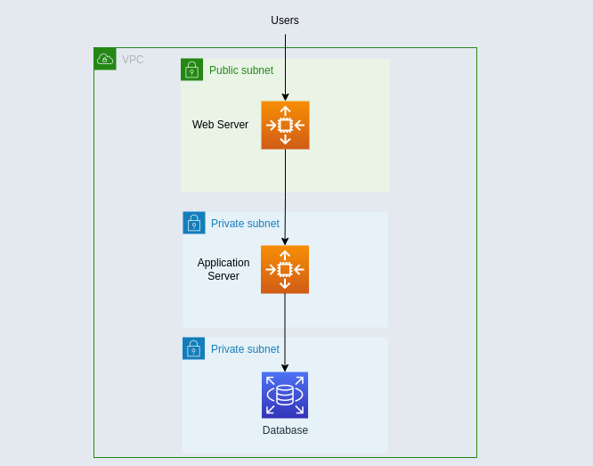

# Simple App deployment on AWS using EKS

## Overview
Deployment of an application AWS EKS with a frontend, backend, and PostgreSQL database, focusing is on infrastructure over app complexity.

## Components
- Frontend: Minimal React with Webpack
- Backend: Simple Java service
- Database: PostgreSQL RDS

## Architecture

1. Networking (VPC)
    -  three-tier web application
    - Public Subnets: Host NAT Gateway, ELB for frontend
    - Private Subnets: Host EKS nodes (pods), RDS
    - NAT Gateway: Outbound internet access for private subnets

2. Compute (EKS)
    - 2 `t3.micro` nodes, each 4 pods.
    - Pods `aws-node` (2), `kube-proxy` (2), `coredns` (1), `backend` (1), `frontend` (1)

3. Storage (RDS)
    - PostgreSQL in private subnets, secured by SG.

4. Secrets (Secrets Manager)
    - Stores DB credentials

## Flow
Browser -> `frontend-external-ip` -> ELB Routes the inbound traffic from the internet to the frontend pods in private subnets -> Nginx serves the UI and proxies to `backend-service` -> Backend writes to RDS -> RDS Stores the data with encryption at rest

## Services used
Amazon EKS, Amazon RDS, AWS Secrets Manager, Amazon VPC, Elastic Load Balancing (ELB), Amazon EC2, AWS KMS, AWS CloudWatch

## Pain Points
1. `FATAL: password authentication failed` - Secrets Manager and RDS password diverged 
 - used master password (temporarily) set manage_master_user_password = false
2. Pod capacity limit `t3.micro` 4-pod limit blocked frontend (pending state)
 - Scaled to 2 nodes
3. Security group misconfiguration initial `main.tf` omitted `node_security_group_id``
 - Included node SG for pod-to-resource traffic in EKS
4. CORS error `fetch('http://backend-service:8080')` failed CORS
 - Nginx proxy `/sum` in frontend pod
5. Initial EKS cluster started at Kubernetes 1.28 caused unexpected cost increase due to extended support
 - Updated cluster version to 1.29 first then 1.30
6. Terraform is great at creating resources, but not the best at deleting/cleaning-up those resources
-  go into the AWS console and just try to delete the same resource yourself
- https://medium.com/ci-cd-devops/the-network-interface-cant-be-deleted-network-interface-is-currently-in-use-6e133963ce75
7. Struggling to install postgresql on AL2
- sudo yum update
- sudo yum search "postgres"
- todo: use user data to install postgresql
8. RDS Query Editor limited to Aurora services
- no solution
9. `Error syncing load balancer: could not find any suitable subnets``
- EKS indetifies its associated subnets by looking for tags with cluster name. Make sure they match.

## Useful Snippets

### Connecting local `kubectl`to EKS
`aws eks update-kubeconfig --region <region> --name <cluster_name>`

### Getting the external IP for LB
`kubectl get svc frontend-service -o wide`
